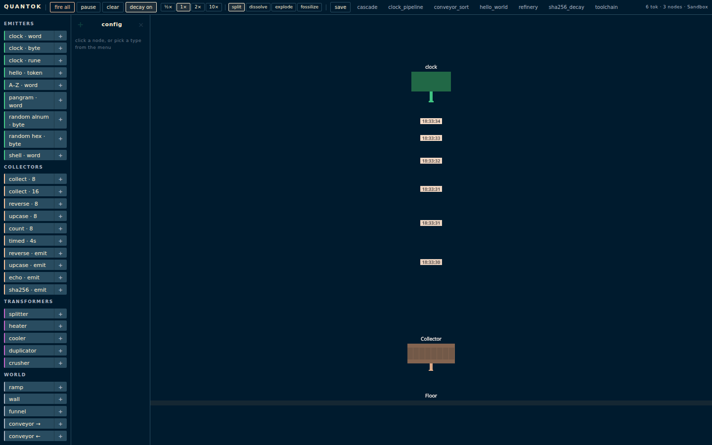
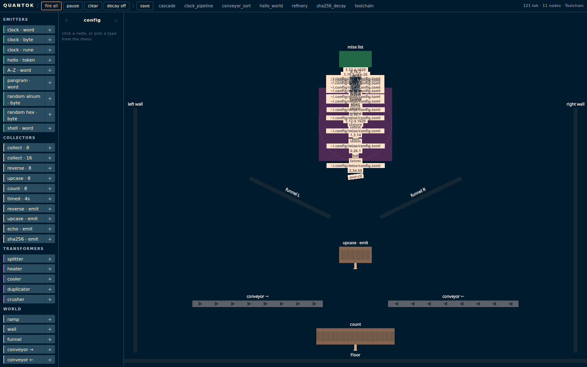
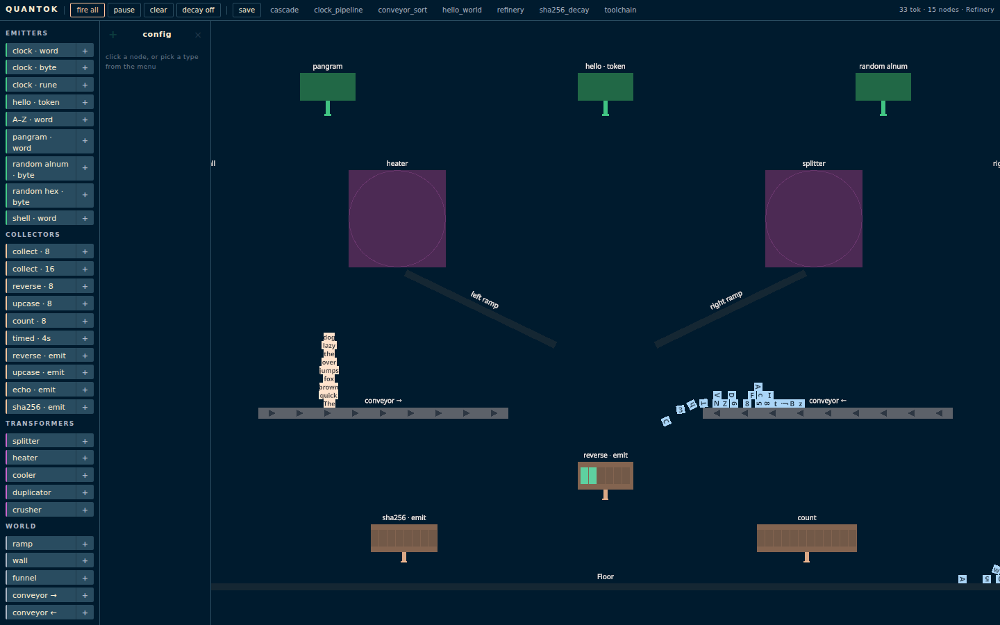
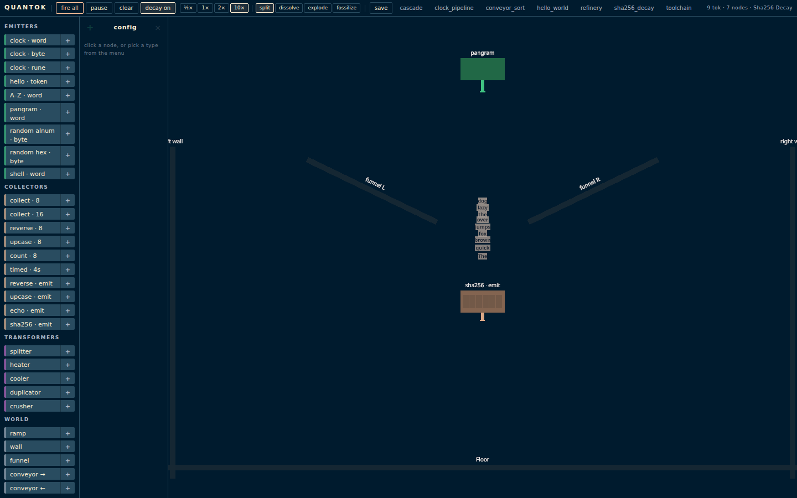

# Quantok

[](https://github.com/phiat/quantok/actions/workflows/ci.yml)
[](LICENSE)

A physics sandbox where data chunks are physical objects.

Emitters produce **tokenes** from commands and data. Tokenes fall through a 2D world affected by gravity, collide with surfaces, pass through transformers, and land in collectors that trigger actions. The chunking granularity — bits, bytes, runes, BPE tokens, words, phrases, sentences — determines a tokene's mass, size, and physical behavior.

| | |
|:-:|:-:|
|  |  |
| *default sandbox — clock dropping word-tokenes* | *toolchain preset — shell `mise list` cascading* |
|  |  |
| *refinery preset after 20s — multi-source pipeline* | *sha256 preset with decay 10× — tokenes fade and split* |

## Quick Start

```bash
just setup   # install deps, create db, download BPE rank files
just run     # start Phoenix server with IEx
```

Open [localhost:4000](http://localhost:4000). You'll see an emitter, a floor, and a collector. Click **fire all** to watch the clock output fall as word-tokenes.

> **Heads up:** the **shell** emitter runs arbitrary commands through `sh -c` on the host. Quantok is a single-user local sandbox — don't expose it to the open internet.

## How It Works

```
Emitter (clock, %H:%M:%S)
    |
    | pipe drops tokenes: "14:23:07" -> "14:23:08" -> ...
    v
  [gravity]
    |
    v
Collector (8 slots) -> triggers action when full
```

- **Emitters** execute a source (clock, sequence, manual text, random bytes, emoji, shell) and chunk the output
- **Collectors** absorb tokenes into a buffer, trigger an action (echo, reverse, upcase, count, hash, shell, sum, min, max). Trigger modes: on-full, manual, or timed (physics-tick interval). Output modes: discard or emit (re-chunk output as new tokenes)
- **Transformers** modify tokenes by proximity — split, crush, heat, cool, duplicate, **tiktoken** (encode any tokene into BPE token-IDs via the [tiktokenex](https://github.com/phiat/tiktokenex) library), **magnet** (continuous attract/repel force field with regex + encoding filters — selectively pull or push specific tokenes through the canvas)
- **Passives** are static geometry — floors, walls, ramps (configurable angle for V-shapes and chutes), conveyors (apply lateral surface velocity), **portals** (paired teleporters; tokenes entering one exit at any other portal on the same channel)

**Sidebar** (left): each row is a split button — click the **body** to preview the node-type in the config panel (right) before adding, or click **+** to drop it into the world immediately with defaults. Either way, the new node briefly highlights so you can spot it. Click any existing node on the canvas to load its config; click **×** in the config header to dismiss.

**Live config**: changes in the config panel (radius, angle, polarity, capacity, …) rebuild the node's mesh, physics body, and sensor zone in place — no page reload. Scroll to zoom, shift+drag to pan.

## Architecture

**Server** (Elixir/Phoenix): World GenServer owns all state with event sourcing — every mutation is recorded as a timestamped event. Emitter firing, absorption, transforms, and triggers are server-authoritative. Events broadcast via PubSub. Full event log enables replay and state reconstruction.

**Client** (Three.js + Rapier2D): Renders the scene with an orthographic camera. troika-three-text for crisp SDF text at any zoom. Bloom post-processing for subtle glow effects. Rapier2D WASM handles physics simulation. Sensor zones detect tokene proximity to collectors and transformers, reporting intersections to the server.

The server never simulates physics. The client never executes commands.

See [docs/architecture.md](docs/architecture.md) for the full module map and data flow.

## Chunking

The core mechanic. The same data chunked at different granularities produces tokenes with different physical properties:

| Encoding | Chunker   | Feel     | Example: `"Hi World! Quantok"`                            |
|----------|-----------|----------|-----------------------------------------------------------|
| bit      | Bit       | sand     | `0 1 0 0 1 0 0 0 …` (136 bits)                            |
| byte     | Byte      | gravel   | `"H" "i" " " "W" "o" "r" "l" "d" "!" " " "Q" "u" …` (17)  |
| rune     | Rune      | pebble   | `"H" "i" " " "W" "o" "r" "l" "d" "!" " " "Q" "u" …` (17)  |
| token    | BPE       | stone    | `"Hi" " World" "!" " Quant" "ok"` (5)                     |
| word     | Word      | brick    | `"Hi" "World!" "Quantok"` (3)                             |
| phrase   | Phrase    | block    | `"Hi World! Quantok"` (1)                                 |
| sentence | Sentence  | boulder  | `"Hi World!" "Quantok"` (2)                               |

Smaller chunks = lighter, more numerous. Larger chunks = heavier, fewer. A sentence-boulder behaves very differently from a stream of bit-sand.

Tokens have two forms. The `token` encoding above is the **text chunk** form — what the BPE chunker emits and what `splitter` produces from a `word`. There is also a `token_id` encoding — the **numeric ID** form (`13347 4435 0 32710 564`) — produced only by the **tiktoken transformer**. Visually they are distinct colors (mint green vs gold) so the two representations don't blur. Splitting a `token_id` chunks its digit string into runes.

## Tokene Decay

Tokenes can optionally decay over time. Each encoding level has a base half-life — coarse encodings (sentences, phrases) decay fast while fine encodings (bytes, bits) are stable or indestructible. Toggle decay globally from the topbar.

| Encoding | Half-life | Feel |
|----------|-----------|------|
| sentence | 8s        | fragile boulder |
| phrase   | 15s       | crumbling block |
| word     | 30s       | weathering brick |
| token    | 45s       | stone, slow weathering |
| token_id | 60s       | compressed, more stable |
| rune     | 60s       | pebble, hardy |
| byte     | 2 min     | slow erosion |
| bit      | infinite  | indestructible |

Three config layers: world defaults, emitter overrides, encoding base half-lives. Decay is computed client-side per-frame (desaturation + opacity fade + death pulse). When integrity drops below threshold, tokenes shatter with one of four behaviors: **split** (child encoding), **dissolve** (vanish), **explode** (burst to bytes), or **fossilize** (freeze as static).

## Collector Buffers

Collectors have visible buffer slots that fill with tokene colors as data is absorbed. Three trigger modes control when a collector fires:

| Mode | When it fires |
|------|--------------|
| `:on_full` | Buffer hits capacity (default) |
| `:manual` | User clicks "trigger" |
| `:timed` | Every N physics ticks (~4s at 30Hz) |

After triggering, the output mode controls what happens to the result:

| Mode | Behavior |
|------|----------|
| `:discard` | Output displayed/logged, not re-emitted (default) |
| `:emit` | Output re-chunked into new tokenes, emitted into the world |

See [docs/collector-buffers.md](docs/collector-buffers.md) for the full redesign plan including emitter pairing, configurable ports, typed slots, and encoding-aware fit-or-bounce mechanics.

## Development

```bash
just check      # run tests + credo + compile warnings
just test       # run tests
just lint       # credo --strict
just fmt        # format all code
```

## Tech Stack

| Layer        | Choice                                                                       |
|--------------|------------------------------------------------------------------------------|
| Backend      | Elixir, Phoenix 1.8, LiveView 1.1, Bandit                                    |
| Rendering    | Three.js, troika-three-text                                                  |
| Physics      | Rapier2D (WASM)                                                              |
| PostFX       | Three.js EffectComposer, bloom                                               |
| Tokenization | [tiktokenex](https://github.com/phiat/tiktokenex) (cl100k_base, o200k_base)  |
| Database     | SQLite (dev) / Postgres (prod)                                               |
| Quality      | Credo, ExUnit                                                                |
| CI           | GitHub Actions                                                               |
| Tasks        | just                                                                         |

## License

MIT — see [LICENSE](LICENSE).
